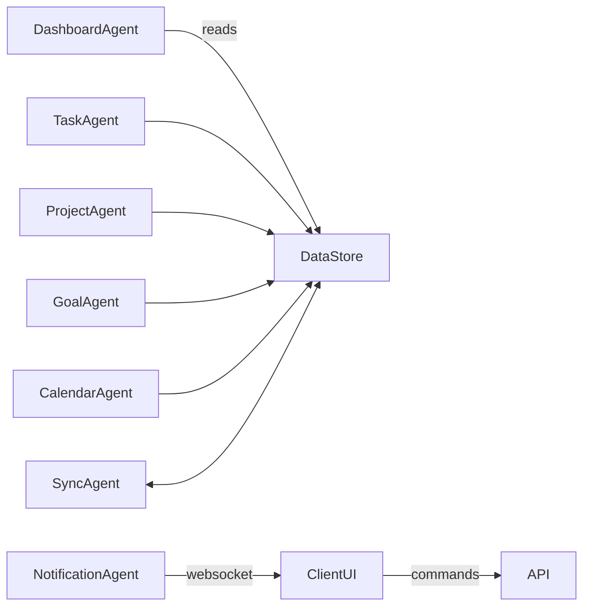

# Task Master – Agent Specification

## Vision
Build a lightweight, local‑first app that shows **exactly** what’s on your plate – today, this week, this month – and helps you knock it out, whether it’s a one‑off task, a multi‑step project, or a long‑term goal.

---

## Tech Assumptions
* **Language**: Python 3.12  
* **Backend**: FastAPI + SQLModel (SQLite by default)  
* **Frontend**: React (Vite) + Tailwind – fully responsive mobile‑first design; packaged as a Progressive Web App (PWA) so Task Master installs on iOS/Android homescreens. (React Native wrapper optional later)  
* **State Sync**: websockets & query polling  
* **Local‑first** with optional cloud sync layer

---

## Shared Data Model (ER‑ish)
| Entity   | Core Fields | Notes |
|----------|-------------|-------|
| **Category** | id, name, color | user‑defined |
| **Task** | id, title, due_date, category_id, status(enum), recurrence(rule), priority, project_id | minimal atomic unit |
| **Project** | id, title, description, category_id | container – owns many Tasks |
| **Goal** | id, title, start_date, end_date, progress(0‑100), category_id | duration‑based |
| **User** | id, name, email | placeholder for eventual sharing |
| **AuditLog** | id, ts, entity, action | for debugging sync |

SQLModel definitions live in `models.py`.

---

## Agent Mesh

### Optional Simplification (skip for Task Master v0.1)
If you ever need to reduce complexity for a future prototype, you *could* collapse everything into two service classes. For now, we’ll proceed with the **full agent mesh** so each concern is cleanly separated from day one.


> Each agent is a **single‑responsibility micro‑service** with a clear input‑output contract. Agents talk over an in‑process message bus (`asyncio.Queue` for PoC; can upgrade to Redis later).



### 1. TaskAgent
| Attribute | Value |
|-----------|-------|
| **Responsibility** | CRUD for Tasks; apply recurrence rules; emit `TaskUpdated` events |
| **Receives** | `CreateTask`, `UpdateTask`, `DeleteTask`, `Tick` |
| **Emits** | `TaskUpdated`, `TaskDueSoon` |

**Codex‑Prompt Skeleton**

```python
"""
You are TaskAgent.
Goal: manage tasks in the SQLite DB via SQLModel and emit domain events.
Focus on single‑purpose functions. Use type hints. Raise ValueError on bad input.
"""
```

### 2. ProjectAgent
| Attribute | Value |
|-----------|-------|
| **Responsibility** | Manage Projects (container of tasks); roll‑up progress; propagate status |
| **Receives** | `CreateProject`, `AddTaskToProject`, `ProjectUpdate` |
| **Emits** | `ProjectProgressUpdated` |

### 3. GoalAgent
Duration tracker; computes % complete daily.

### 4. CalendarAgent
Transforms dated entities into iCal and supports recurring rules (rrule).

### 5. DashboardAgent
Aggregates today/this week/this month snapshots, plus progress bars.

### 6. SyncAgent (later)
Handles multi‑device conflict resolution.

### 7. NotificationAgent (later)
Pushes “heads‑up” websockets & desktop notifications.

---

## API Surface (v0)
| Method | Route | Purpose |
|--------|-------|---------|
| POST | /tasks | create task |
| PUT | /tasks/{id} | update |
| PATCH | /tasks/{id}/complete | mark done |
| GET | /dashboard | aggregated counts |

(Scaffold with FastAPI generator.)

---

## Development Roadmap
1. **Bootstrap repo**  
   ```bash
   git init
REM (Optional) create a repository named **task-master** on GitHub via the web UI, then:
git remote add origin https://github.com/<your‑username>/task-master.git
git push -u origin main
   ```
2. `models.py` – data classes & Alembic migration
3. Generate skeletons for **TaskAgent, ProjectAgent, GoalAgent, CalendarAgent, DashboardAgent** (empty methods + docstrings) and wire up CRUD endpoints for TaskAgent
4. Minimal React UI: list & create tasks **(mobile‑responsive, PWA shell)**
5. Calendar view via `fullcalendar.io` + add PWA manifest & service‑worker for install
6. Projects tab
7. Goals tab & progress calc
8. Websocket push
9. Sharing v0

Keep branches small (`feat/task-crud`, `feat/calendar-view`), squash‑merge.

---

## Codex Usage Patterns

### Pattern A – Green‑field File
> “Write `task_agent.py` implementing TaskAgent as described in AGENTS.md §1. Use SQLModel.”

### Pattern B – Refactor
> “Refactor `project_agent.py` to extract the roll‑up progress calc into `goal_utils.py` with tests.”

### Pattern C – Test‑first
> “Generate pytest tests for TaskAgent covering edge cases (past due, recurrence).”

Always paste **only** the relevant context (filename + snippet) to Codex, ask for focused change, then review diff.

---

## Prompt Library (Copy‑Paste)

| Intent | Prompt |
|--------|--------|
| Generate route | `Create a FastAPI route in routes/tasks.py that calls TaskAgent.create` |
| Add field | `Add 'priority: int = 0' to Task model, update pydantic schema and migrations` |
| Write hook | `In CalendarAgent, write a function to convert Task objects with recurrence into all occurrences between two dates` |

---

## License
MIT

---

Feel free to extend/PR!
